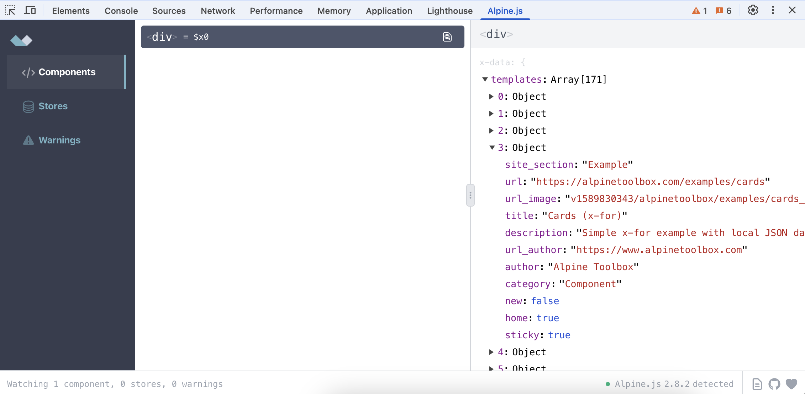
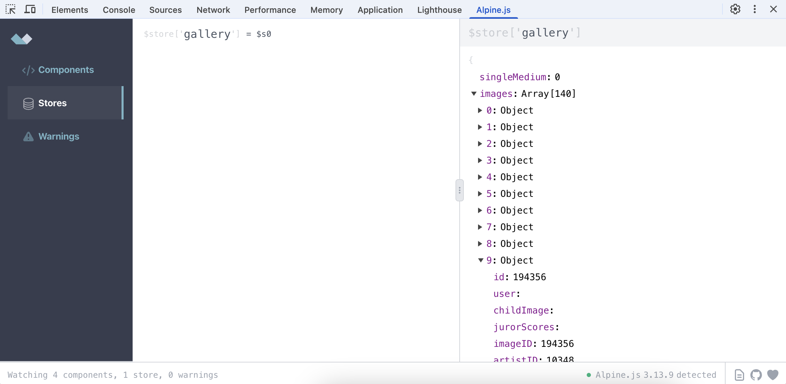
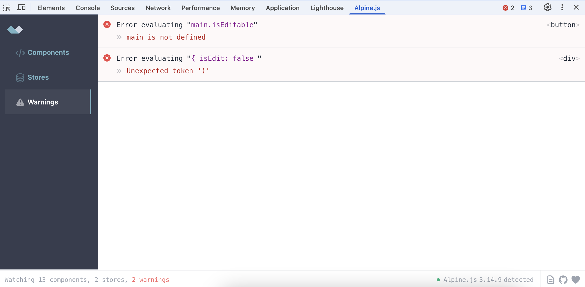

## Component inspection

- View component list, view/edit component data
- Displays an overlay on hover to quickly identify components while browsing
- Component data in console globals (component data is available as `$x0`, `$x1` and so on in the browser devtools console).
- New, [**Early Access feature**](https://alpinedevtools.com/pricing): jump to root element in Chrome inspector

## Improve state synchronisation and performance

In both **Free** and **Early Access** releases.

No need to wait for updates, refresh or close/reopen devtools.

- Performance improvement: tested on datasets with over 10,000 properties
- State synchronisation improvements: data changes on page reflected in devtools, page reload sets correct state

## Store inspection

New, [**Early Access feature**](https://alpinedevtools.com/pricing).

- View stores list
- View/edit store data

## Warnings

[**Early Access feature**](https://alpinedevtools.com/pricing)

- When Alpine encounters an invalid expression during evaluation it will throw and crash the component.
- This feature displays the errors in a formatted log.
- The originating element can be inspected in devtools by clicking on the element name on the right of the log line.
