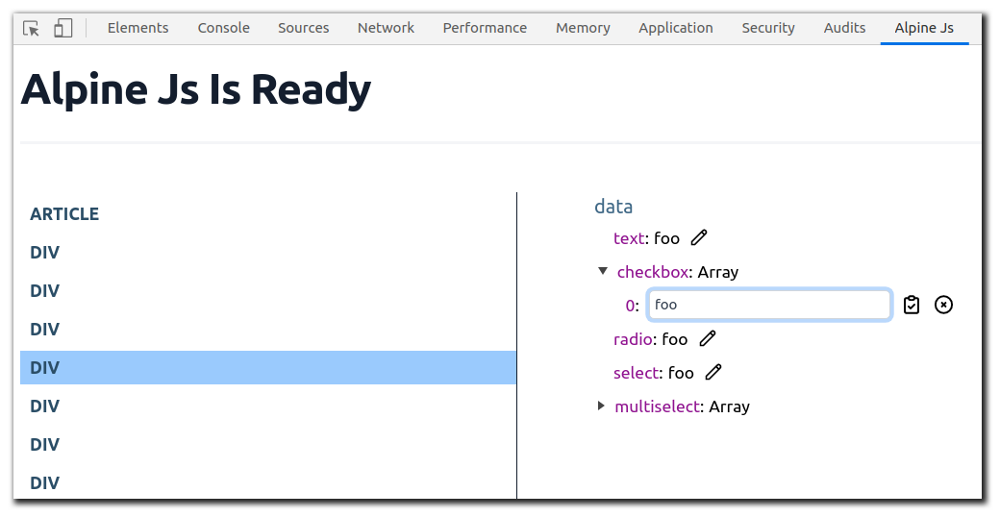

# alpinejs-devtools

alpinejs-devtools is a simple extension to help you debug [Alpine.js](https://github.com/alpinejs/alpine) apps easily.

> Note: this extension is mainly inspired by [Vue Devtools](https://github.com/vuejs/vue-devtools). so some of the code is borrowed from those awesome folks.

## Installation

- [Get the Chrome Extension](https://chrome.google.com/webstore/detail/alpinejs-devtools/fopaemeedckajflibkpifppcankfmbhk)
- _Coming soon_ Firefox Extension, for now see [Installing the dev extensions on Firefox](#installing-the-dev-extension-on-firefox)

### Development

1. Clone this repo
2. Run `npm install`
3. Run `npm run dev`
4. Load unpacked extension inside dist/chrome directory
4. Open any html file that imports alpine js then inspect by dev chrome inspection tool.

#### Installing the dev extension on Firefox

1. Follow the [Development](#development) instructions to get a devlopment build.
2. Go to [about:debugging](about:debugging) in Firefox
3. Click the "This Firefox" tab (left side nav)
4. Click "Load Temporary Add-on..."
5. Open one of the files in the built extension folder ([./dist/chrome](./dist/chrome))

### License

[MIT](http://opensource.org/licenses/MIT)