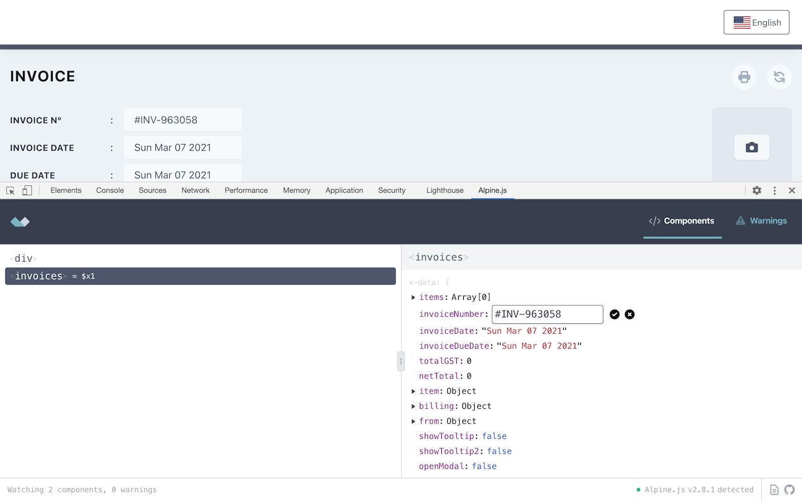

# alpinejs-devtools

alpinejs-devtools is a simple extension to help you debug [Alpine.js](https://github.com/alpinejs/alpine) apps easily.

> Note: this extension is mainly inspired by [Vue Devtools](https://github.com/vuejs/vue-devtools). so some of the code is borrowed from those awesome folks.

## Installation

-   [Get the Chrome Extension](https://chrome.google.com/webstore/detail/alpinejs-devtools/fopaemeedckajflibkpifppcankfmbhk)
-   [Get the Firefox Extension](https://addons.mozilla.org/firefox/addon/alpinejs-devtools/)

If you are using Google Chrome, Alpine Devtools won't work with local files unless you configure the extension to be allowed `Access to File URLs`. You can allow it by following these steps:

1. Open chrome settings
2. Go to `extensions` tab
3. Choose `Alpine.js devtools` and press details
4. Enable `Allow access to file URLs`

Check the following screenshot with it enabled

To help with inspection, component "names" are be computed from the following attributes (if present and in order of precedence): id, name, x-data function name (if a function is used), tag name.

### Development

1. Clone this repo
2. Run `npm install`
3. Run `npm run dev`
4. Load unpacked extension inside dist/chrome directory
5. Open any html file that imports alpine js then inspect by dev chrome inspection tool.

#### Installing the dev extension on Firefox

1. Follow the [Development](#development) instructions to get a development build.
2. Go to [about:debugging](about:debugging) in Firefox
3. Click the "This Firefox" tab (left side nav)
4. Click "Load Temporary Add-on..."
5. Open one of the files in the built extension folder ([./dist/chrome](./dist/chrome))

### License

[MIT](LICENSE.md)
